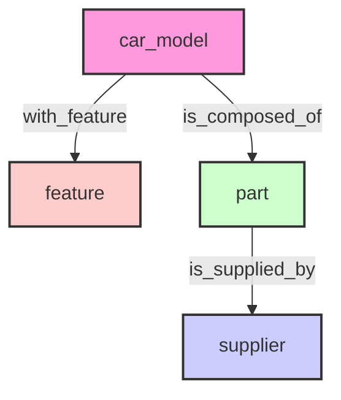
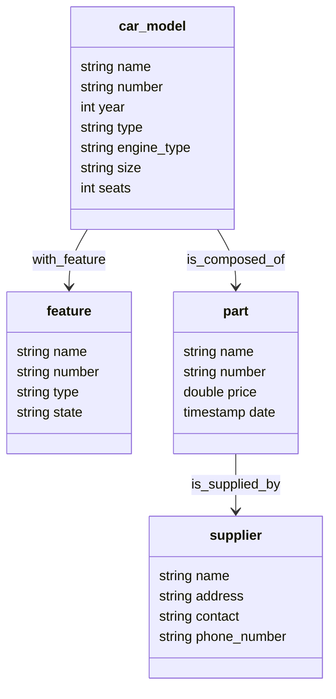

## Schema

### Structure



### Properties



## DDL

```sql
CREATE SPACE IF NOT EXISTS auto_manufacturing_supply_chain (vid_type=FIXED_STRING(64), partition_num=1, replica_factor=1);

CREATE TAG IF NOT EXISTS car_model(name string, number string, year int, type string, engine_type string, size string, seats int);
CREATE TAG IF NOT EXISTS feature(name string, number string, type string, state string);
CREATE TAG IF NOT EXISTS part(name string, number string, price double, date timestamp);
CREATE TAG IF NOT EXISTS supplier(name string, address string, contact string, phone_number string);

CREATE EDGE IF NOT EXISTS with_feature(version string);
CREATE EDGE IF NOT EXISTS is_composed_of(version string);
CREATE EDGE IF NOT EXISTS is_supplied_by(version string);
```