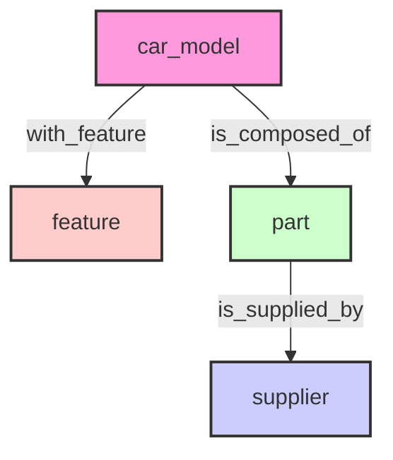
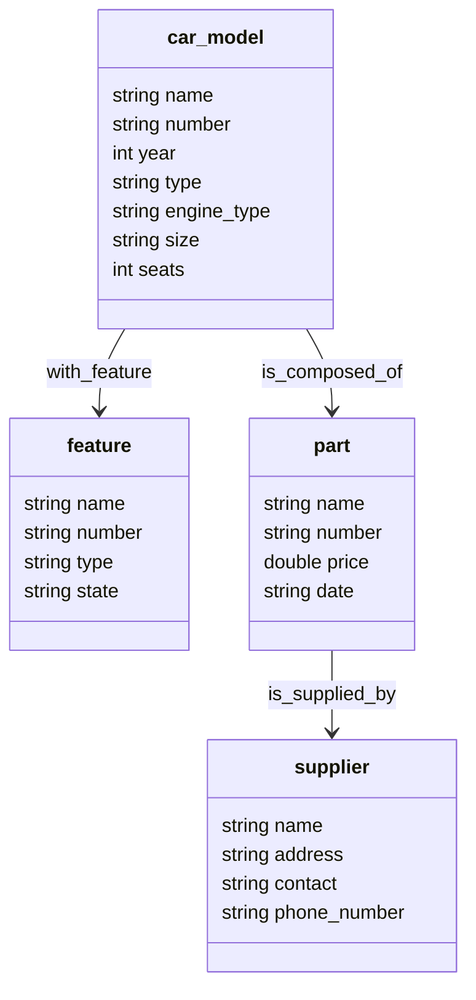

<!-- TOC start (generated with https://github.com/derlin/bitdowntoc) -->

- [Graph Schema](#graph-schema)
  * [Structure](#structure)
  * [Properties](#properties)
- [DDL](#ddl)
- [Data Ingest](#data-ingest)
  * [With NebulaGraph Importer v4](#with-nebulagraph-importer-v4)
  * [Get Stats](#get-stats)
- [Credits](#credits)

<!-- TOC end -->

<!-- TOC --><a name="graph-schema"></a>
## Graph Schema

It come with 4 TAGS and 3 EDGE TYPES, and it looks like this:

<p align="center">
  <a href="https://www.siwei.io/demo-dumps/adhoc-graphs/nebulagraph_export_supply_chain.html">
    
  </a>
  <br>
  <small>
    <i>Graph: Auto manufacturing supply chain</i>,
    <a href="https://www.siwei.io/demo-dumps/adhoc-graphs/nebulagraph_export_supply_chain.html">
      renderred graph
    </a>
  </small>
</p>

Let's see its details.

<!-- TOC --><a name="structure"></a>
### Structure



<!-- TOC --><a name="properties"></a>
### Properties



<!-- TOC --><a name="ddl"></a>
## DDL

```sql
CREATE SPACE IF NOT EXISTS auto_manufacturing_supply_chain (vid_type=FIXED_STRING(64), partition_num=1, replica_factor=1);

CREATE TAG IF NOT EXISTS car_model(name string, number string, year int, type string, engine_type string, size string, seats int);
CREATE TAG IF NOT EXISTS feature(name string, number string, type string, state string);
CREATE TAG IF NOT EXISTS `part`(name string, number string, price double, `date` string);
CREATE TAG IF NOT EXISTS supplier(name string, address string, contact string, phone_number string);

CREATE EDGE IF NOT EXISTS with_feature(version string);
CREATE EDGE IF NOT EXISTS is_composed_of(version string);
CREATE EDGE IF NOT EXISTS is_supplied_by(version string);
```

<!-- TOC --><a name="data-ingest"></a>
## Data Ingest

Remove `--network=nebula-net` and modify the graphd address in `importer_v4_config.yaml` if you are not running NebulaGraph with docker-compose in same host.

<!-- TOC --><a name="with-nebulagraph-importer-v4"></a>
### With NebulaGraph Importer v4

```
docker run --rm -ti \
    --network=nebula-net \
    -v ${PWD}/data_sample:/root \
    -v ${PWD}/importer_v4_config.yaml:/root/importer_v4_config.yaml \
    vesoft/nebula-importer:v4.0.0 \
    --config /root/importer_v4_config.yaml
```

Result will be like:

```log
{"level":"info","ts":"2023-09-07T08:57:01Z","caller":"manager/manager.go:416","msg":"0s 0s 100.00%(3.1 KiB/3.1 KiB) Records{Finished: 129, Failed: 0, Rate: 3397.47/s}, Requests{Finished: 7, Failed: 0, Latency: 3.069285ms/4.945996ms, Rate: 184.36/s}, Processed{Finished: 129, Failed: 0, Rate: 3397.47/s}"}
```

<!-- TOC --><a name="get-stats"></a>
### Get Stats

```sql
SUBMIT JOB STATS;
SHOW STATS;
```

Result will be like:

| Type  | Name           | Count |
| :---- | :------------- | :---- |
| Tag   | car_model      | 10    |
| Tag   | feature        | 10    |
| Tag   | part           | 10    |
| Tag   | supplier       | 10    |
| Edge  | is_composed_of | 14    |
| Edge  | is_supplied_by | 10    |
| Edge  | with_feature   | 38    |
| Space | vertices       | 40    |
| Space | edges          | 62    |


<!-- TOC --><a name="credits"></a>
## Credits

The idea of this dataset comes from Julia XIAO, the Customer Success Engineer of NebulaGraph.

Due to I don't have bandwidth to prepare the datagen this time, I instead tried to ask ChatGPT-4 to help generate a small sample data first. See [here](https://chat.openai.com/share/10413cc3-8d4a-4795-88a2-3d231e4cfd9c) for the chat log.
