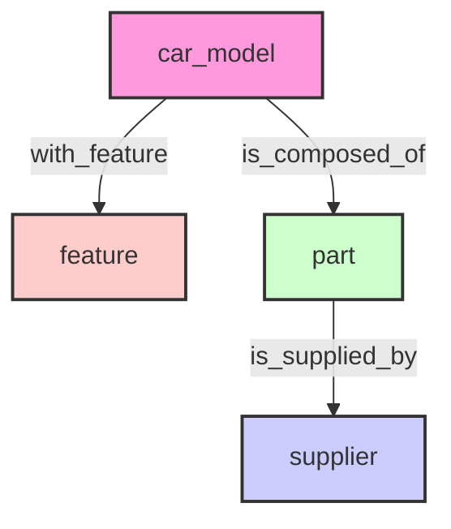
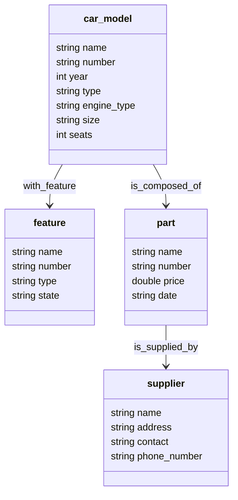

## Schema

### Structure



### Properties



## DDL

```sql
CREATE SPACE IF NOT EXISTS auto_manufacturing_supply_chain (vid_type=FIXED_STRING(64), partition_num=1, replica_factor=1);

CREATE TAG IF NOT EXISTS car_model(name string, number string, year int, type string, engine_type string, size string, seats int);
CREATE TAG IF NOT EXISTS feature(name string, number string, type string, state string);
CREATE TAG IF NOT EXISTS `part`(name string, number string, price double, `date` string);
CREATE TAG IF NOT EXISTS supplier(name string, address string, contact string, phone_number string);

CREATE EDGE IF NOT EXISTS with_feature(version string);
CREATE EDGE IF NOT EXISTS is_composed_of(version string);
CREATE EDGE IF NOT EXISTS is_supplied_by(version string);
```

## Data Ingest

Remove `--network=nebula-net` and modify the graphd address in `importer_v4_config.yaml` if you are not running NebulaGraph with docker-compose in same host.

```
docker run --rm -ti \
    --network=nebula-net \
    -v ${PWD}/data_sample:/root \
    -v ${PWD}:/root/config \
    vesoft/nebula-importer:v4.0.0 \
    --config /root/config/importer_v4_config.yaml
```

## Credits

The idea of this dataset comes from Julia XIAO, the Customer Success Engineer of NebulaGraph.

Due to I don't have bandwidth to prepare the datagen this time, I instead tried to ask ChatGPT-4 to help generate a small sample data first. See [here](https://chat.openai.com/share/10413cc3-8d4a-4795-88a2-3d231e4cfd9c) for the chat log.
